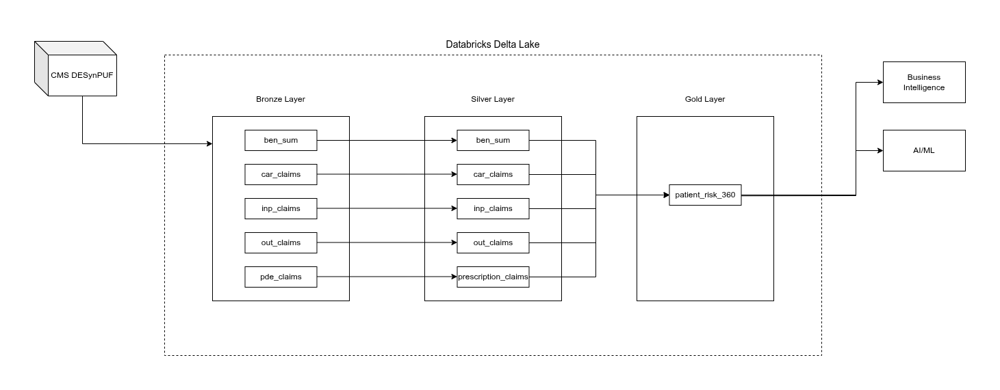

# Payer-Scale Medallion Lakehouse: Longitudinal High-Risk Patient & Cost Analytics

## Business Context & Objective
Health plans face significant challenges in identifying **"high-risk, high-cost"** members due to fragmented data silos across Inpatient, Outpatient, and Pharmacy claims.

This project implements a **Medallion Architecture** on Databricks to ingest raw **CMS DE SynPUF** datasets. The goal is to build a unified Gold **Patient 360** table that identifies **multi-chronic cohorts (Diabetes + CKD)** and calculates key metrics like **Total Cost of Care (TCOC)** and **Provider Fragmentation Index** to drive better care management decisions.

## Architecture & Data Flow (ELT)
The pipeline follows a modern **ELT (Extract, Load, Transform)** pattern to ensure full data auditability:

- **Bronze (Raw Layer):** Automated ingestion of CMS ZIP/CSV files using COPY INTO. Includes metadata tagging (BEN_INSERTED_YEAR) for longitudinal tracking.

- **Silver (Conformed Layer):** Security: SHA-256 Hashing of patient_id and provider_id for HIPAA-compliant de-identification.

- **Quality:** Schema enforcement, type casting, and deduplication using window functions.

- **Gold (Analytical Layer):** Flattened Patient 360 view aggregating spend across four claim types (Inpatient, Outpatient, Carrier, Pharmacy).

## Technical Stack
- **Platform:** Databricks (Community Edition)

- **Language:** PySpark, SparkSQL

- **Storage:** Delta Lake (Parquet-backed)

- **Security:** SHA-256 Tokenization

## Key Features & Engineered Metrics
- **is_diabetic_ckd_high_risk:** A boolean flag identifying the intersection of Diabetes and Chronic Kidney Disease.

- **Total Cost of Care (TCOC):** Aggregated spend across ip_spend, op_spend, car_spend, and rx_spend.

- **Rescue-to-Preventive Ratio:** A calculated metric comparing Inpatient spend to Pharmacy/Carrier spend to identify gaps in preventive care.

- **Provider Count:** Measures care fragmentation by tracking unique providers seen by a single patient.

- **us_healthcare_notebook.ipynb:** This notebook includes every Python and SQL queries used within databricks catalog.

## Sample Insights
Preliminary analysis of the Gold layer shows that patients identified as High-Risk (Diabetes + CKD) exhibit:

- 3.5x higher average Total Cost of Care compared to the general population.

- Significantly higher Provider Counts, indicating potential care fragmentation.

## Security & Compliance
- **PHI Protection:** All patient and provider identifiers are tokenized using SHA-256 hashing at the entry point of the Silver layer.

- **Auditability:** _ingested_at timestamps and source file tracking maintained in Bronze for full lineage.
